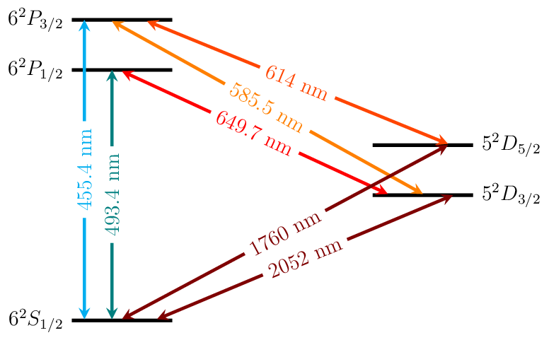

Barium
======

Energy Level Diagrams
---------------------

Photoionization Wavelengths
---------------------------

Neutral barium: S to singlet P transition at 553.5 nm

Transition Strengths
--------------------

Branching ratio from |P1/2| to |D3/2| vs |P1/2| to |S1/2|: 0.3

Useful Links
------------

Physical Properties
~~~~~~~~~~~~~~~~~~~

* Wikipedia__
* `Ba II lines (NIST)`__

__ https://en.wikipedia.org/wiki/Barium
__ http://physics.nist.gov/PhysRefData/Handbook/Tables/bariumtable4.htm

Research Groups
~~~~~~~~~~~~~~~

* Innsbruck_
* `Georgia Tech`_
* Northwestern_
* `University of Washington`_

.. include:: replacements.rst
.. include:: group_links.rst
.. include:: license.rst
