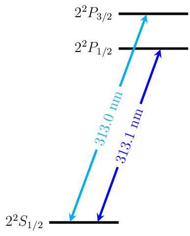

Beryllium
=========

Energy Level Diagrams
---------------------

Photoionization Wavelengths
---------------------------

Neutral beryllium: S to singlet P transition at 234.8 nm

Transition Strengths
--------------------

Useful Links
------------

Physical Properties
~~~~~~~~~~~~~~~~~~~

* Wikipedia__
* `Be II lines (NIST)`__

__ https://en.wikipedia.org/wiki/Beryllium
__ http://physics.nist.gov/PhysRefData/Handbook/Tables/berylliumtable4.htm

Research Groups
~~~~~~~~~~~~~~~

* NIST_

.. include:: group_links.rst
.. include:: license.rst
