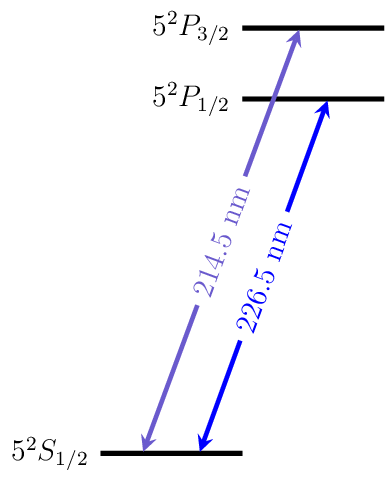

Cadmium
=======

Energy Level Diagrams
---------------------

Photoionization Wavelengths
---------------------------

Transition Strengths
--------------------

Useful Links
------------

Physical Properties
~~~~~~~~~~~~~~~~~~~

* Wikipedia__
* `Energy levels of Cd II (NIST)`__

__ https://en.wikipedia.org/wiki/Cadmium
__ http://physics.nist.gov/PhysRefData/Handbook/Tables/cadmiumtable4.htm

Research Groups
~~~~~~~~~~~~~~~

* Maryland_

.. include:: group_links.rst
.. include:: license.rst
