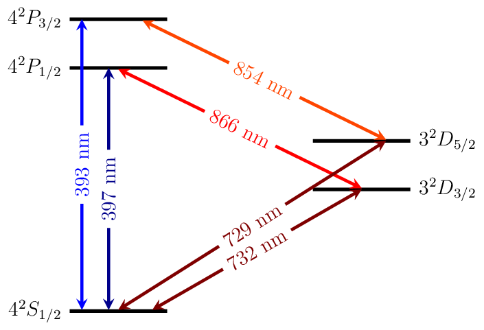

Calcium
=======

Energy Level Diagrams
---------------------

Photoionization Wavelengths
---------------------------

Transition Strengths
--------------------

Useful Links
------------

Physical Properties
~~~~~~~~~~~~~~~~~~~

* Wikipedia__
* `Energy levels of Ca II (NIST)`__

__ https://en.wikipedia.org/wiki/Calcium
__ http://physics.nist.gov/PhysRefData/Handbook/Tables/calciumtable6.htm

Research Groups
~~~~~~~~~~~~~~~

* Aarhus_
* Berkeley_
* Innsbruck_
* Oxford_

.. _Aarhus: http://phys.au.dk/forskning/forskningsomraader/amo/the-ion-trap-group/
.. _Berkeley: http://physics.berkeley.edu/research/haeffner/index.html
.. _Innsbruck: http://www.quantumoptics.at/
.. _Oxford: http://www2.physics.ox.ac.uk/research/ion-trap-quantum-computing-group

.. include:: license.rst

