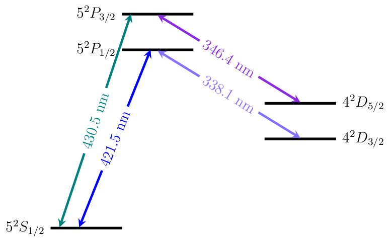

Strontium
=========

Energy Level Diagrams
---------------------

Photoionization Wavelengths
---------------------------

Neutral Strontium: S to singlet P transition at 460.7 nm plus 412 nm
to continuum.  There is also a strong auto-ionization line at 405.5 nm
(single laser, 2 photon transition).

Transition Strengths
--------------------

Branching ratio from |P1/2| to |D3/2| vs |P1/2| to |S1/2|: 1:13

Useful Links
------------

Physical Properties
~~~~~~~~~~~~~~~~~~~

* Wikipedia__
* `Sr II lines (NIST)`__

__ https://en.wikipedia.org/wiki/Strontium
__ http://physics.nist.gov/PhysRefData/Handbook/Tables/strontiumtable4.htm

Research Groups
~~~~~~~~~~~~~~~

* MIT_
* MIT Lincoln Lab
* NIST_

.. include:: replacements.rst
.. include:: group_links.rst
.. include:: license.rst
